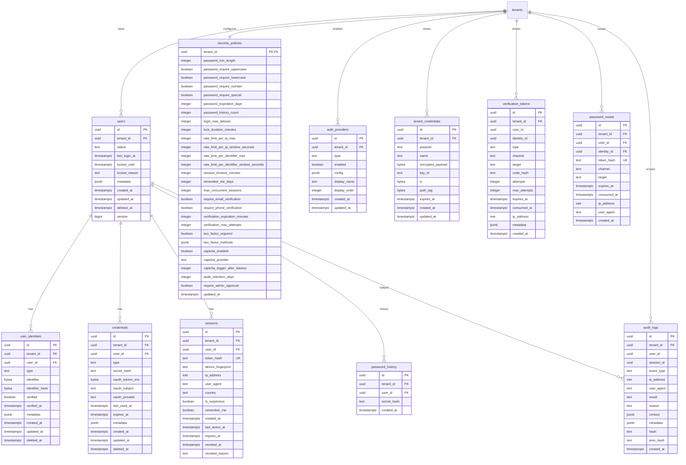
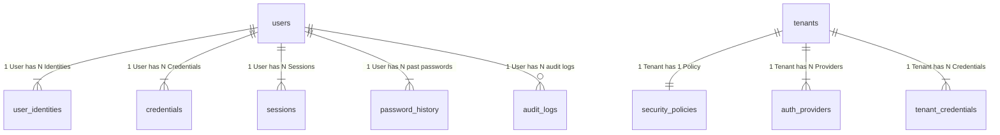
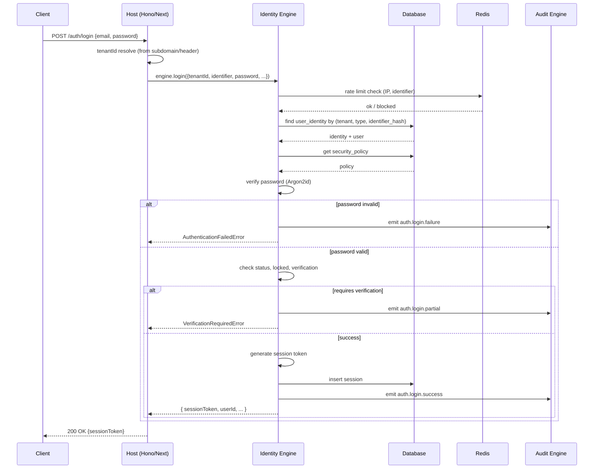
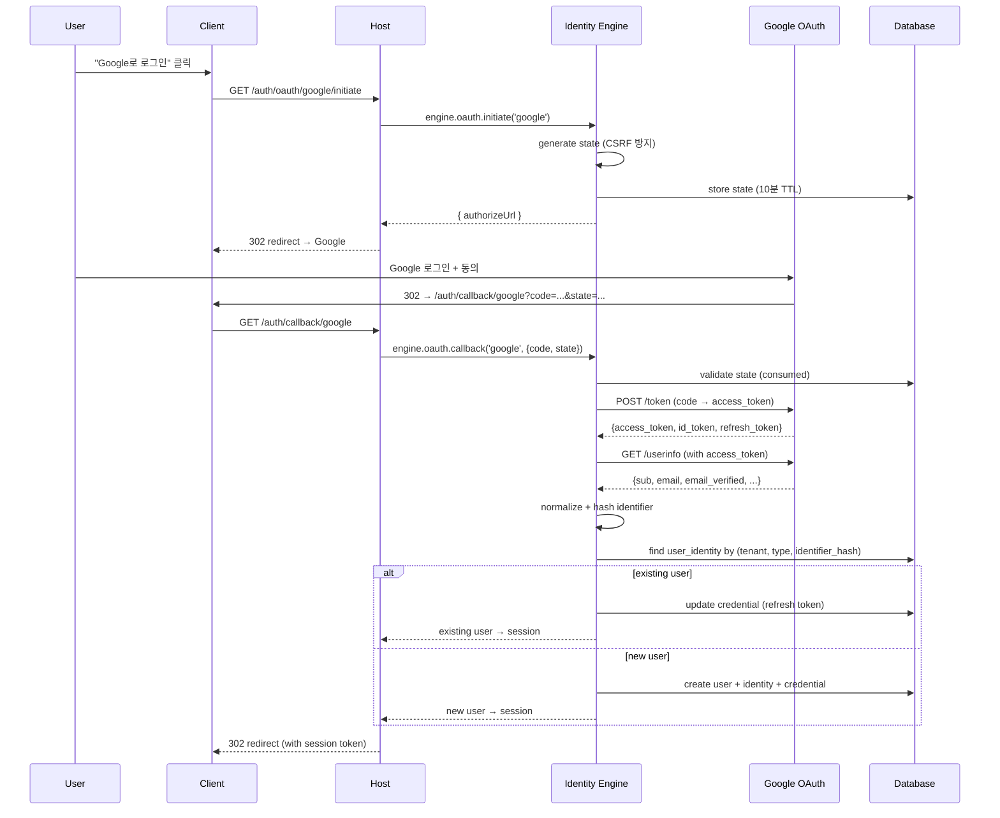
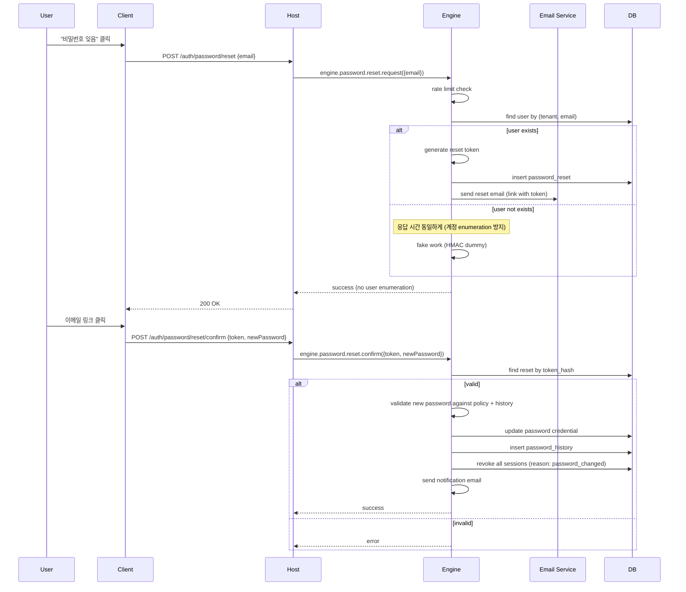
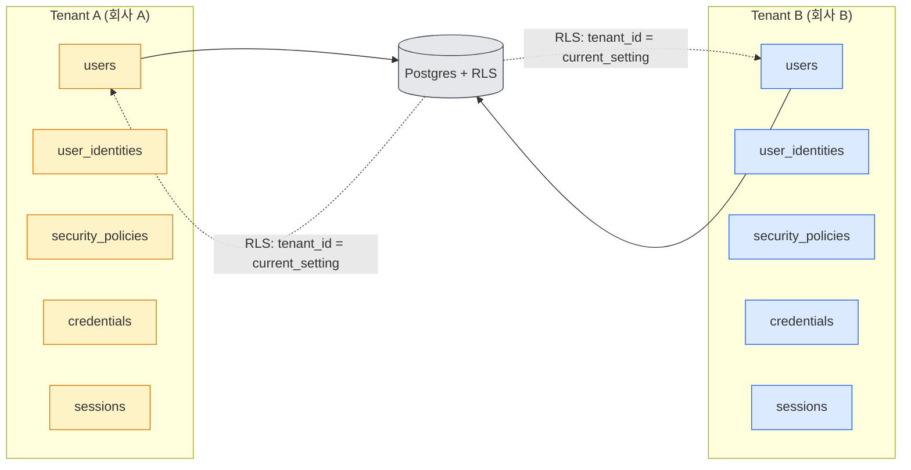
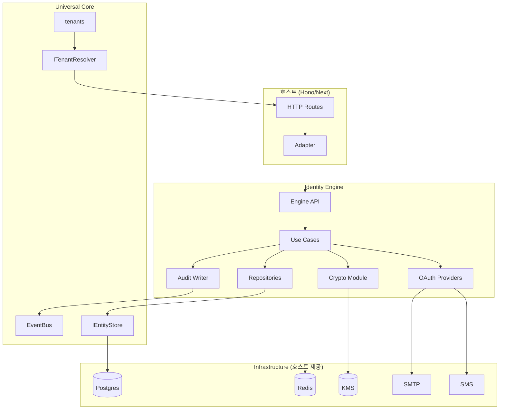
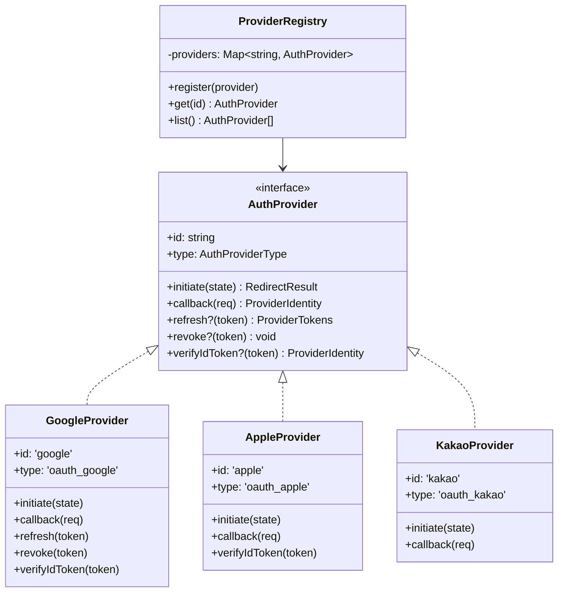
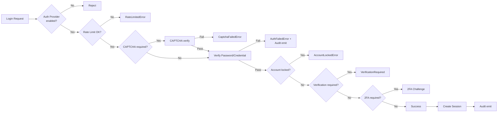

# Identity Engine — Entity Relationship Diagram (ERD)

**Version**: v1.0
**Status**: Frozen (사장님 확립, 2026-07-11)
**Companion to**: [03-domain-model.md](./03-domain-model.md), [04-db-schema.md](./04-db-schema.md)

---

## 0. 문서 위치

이 문서는 **모든 엔티티의 관계**를 시각화합니다.

- **다이어그램 형식**: Mermaid (GitHub, Obsidian, Notion 호환)
- **Cardinality 표기**: `||` (exactly one), `o|` (zero or one), `}o` (zero or many), `}|` (one or many)

---

## 1. 전체 ERD (Master View)

---

## 2. Aggregate 중심 ERD (도메인 이해용)

---

## 3. 인증 흐름 시퀀스 다이어그램

### 3.1 Email/Password 로그인

### 3.2 OAuth 로그인 (Google 예시)

### 3.3 비밀번호 재설정

---

## 4. Multi-Tenant 격리 시각화

**격리 메커니즘**:
1. 모든 테이블에 `tenant_id` 컬럼
2. RLS로 `tenant_id = current_setting('app.current_tenant_id')` 강제
3. 호스트가 매 요청마다 `SET LOCAL app.current_tenant_id = '...'`
4. 엔진 코드도 모든 쿼리에 `tenant_id` 명시 (Defense in Depth)

---

## 5. 데이터 흐름 (Identity Engine ↔ Universal Core ↔ 호스트)

---

## 6. OAuth Provider Plugin 구조

**새 Provider 추가 시**:
1. `providers/<name>/index.ts` 작성
2. `providers/<name>/manifest.ts` 작성
3. `ProviderRegistry.register()` 호출 (1줄)
4. 기존 코드 0줄 수정

---

## 7. 정책 평가 흐름

---

## 8. [TBD: 사장님 확립 필요]

| 항목 | 기본 제안 |
|---|---|
| ERD 도구 | Mermaid (GitHub/문서 호환) |
| PlantUML 등 추가 도구 | 불필요 (Mermaid로 충분) |
| 시각화 깊이 (상세/축약) | 본 문서는 Master + 상세 시퀀스 + 정책 흐름 모두 포함 |

---

**End of ERD v1.0**