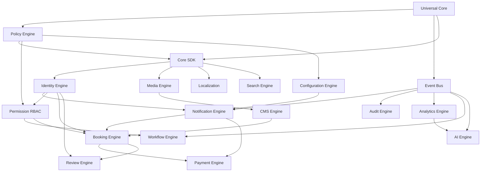

# Engine Dependency Graph (EDG)

> **사장님 CEO 확립 (2026-07-11)**
> **엔진 간 의존성 그래프 — 플랫폼 전체에서 가장 많이 참고하는 문서**

**Version**: v1.0
**Status**: 🔒 FROZEN (헌법 §C-13 적용, 변경은 ADR)
**Effective Date**: 2026-07-11
**Owner**: 사장님 (박흥식 / Tim Park)
**Companion**: [헌법 §C-18](./000_PLATFORM_CONSTITUTION.md), [engine.json schema](./engine.schema.json)

---

## 0. 목적

> **엔진들이 서로 어떻게 의존하는지 시각적으로 표현.**
> **새 엔진 추가 시, 기존 엔진과의 의존 관계를 등록.**
> **CI가 순환 의존성 (Circular Dependency) 자동 검증.**

이 문서는 **플랫폼 전체에서 가장 많이 참고하는 문서**가 될 것입니다.

---

## 1. 의존성 규칙 (헌법 §C-18)

### C-18 — Circular Dependency 절대 금지

> **엔진은 항상 상위 → 하위만 참조한다. 절대 A ↔ B가 되면 안 된다.**

```
[허용] 상위 → 하위
Identity
    ↓
Notification

[금지] 순환 의존
Identity ↔ Notification
```

위반 시:
- CI 자동 차단
- ADR 없이 해결 불가
- 플랫폼 전체 재설계 위험

### 1.1 의존성 방향 규칙

| 규칙 | 설명 |
|---|---|
| **상위 → 하위만** | 상위 엔진이 하위 엔진에 의존. 역방향 금지. |
| **Universal Core 의존 허용** | 모든 엔진은 Universal Core에 의존 가능. |
| **Engine-to-Engine 직접 import 금지** | Event Bus 경유만. 직접 호출 ❌. |
| **자기 자신 의존 금지** | 자기 자신을 의존 리스트에 넣을 수 없음. |

---

## 2. 엔진 개발 순서 (CEO 확립, 2026-07-11)

> **사장님 CEO: "이 순서를 절대 바꾸지 않을 것입니다."**

| Phase | 엔진 | 의존성 | Status |
|---|---|---|---|
| **Phase 1** | **Policy Engine** | (Universal Core) | ✅ Frozen |
| **Phase 1** | **Core SDK** | Policy + Universal Core | ✅ Frozen |
| **Phase 1** | **Identity Engine** | Policy + Core SDK + Universal Core | ✅ Frozen |
| **Phase 2** | Configuration Engine | Policy | 🟡 예정 |
| **Phase 2** | Event Bus | Universal Core | 🟡 예정 |
| **Phase 2** | Notification Engine | Identity + Event Bus | 🟡 예정 |
| **Phase 3** | Media Engine | Core SDK | 🟡 예정 |
| **Phase 3** | CMS Engine | Media + Core SDK | 🟡 예정 |
| **Phase 3** | Localization Engine | Core SDK | 🟡 예정 |
| **Phase 4** | Audit Engine | Event Bus | 🟡 예정 |
| **Phase 4** | Permission (RBAC) Engine | Identity + Policy | 🟡 예정 |
| **Phase 4** | Workflow Engine | Event Bus + RBAC | 🟡 예정 |
| **Phase 5** | Booking Engine | Identity + Notification + RBAC | 🟡 예정 |
| **Phase 5** | Payment Engine | Booking + Notification | 🟡 예정 |
| **Phase 5** | Review Engine | Identity + Booking | 🟡 예정 |
| **Phase 6** | Analytics Engine | Event Bus | 🟡 예정 |
| **Phase 6** | AI Engine | Event Bus + Analytics | 🟡 예정 |
| **Phase 6** | Search Engine | Core SDK | 🟡 예정 |

---

## 3. 의존성 그래프 (시각화)

### 3.1 Phase 1 (Frozen ✅)

```
              Universal Core (IEntityStore, IEventBus, ITenantResolver)
                      │
            ┌─────────┴─────────┐
            ↓                   ↓
        Policy              Core SDK
        Engine              (Logger, Config, Errors,
        (IPolicyProvider)    Result, Event, Validation)
            │                   │
            └─────────┬─────────┘
                      ↓
                 Identity
                 Engine
                 (Login, Register, OAuth)
```

**Edge 설명**:
- `Policy` → `Universal Core`
- `Core SDK` → `Policy`, `Universal Core`
- `Identity` → `Policy`, `Core SDK`, `Universal Core`

### 3.2 Phase 2

```
   Policy          Event Bus ←──────────┐
     │                │                  │
     ↓                ↓                  │
   (Phase 1)     Configuration          │
                 Engine                  │
                      │                  │
                      └────┬─────────────┘
                           ↓
                      Notification
                       Engine
                           ↑
                           │
                       Identity
                      (Phase 1)
```

**Edge 설명**:
- `Configuration` → `Policy`
- `Event Bus` → `Universal Core`
- `Notification` → `Identity`, `Event Bus`, `Configuration`

### 3.3 Phase 3

```
   Core SDK
     │
     ↓
  Media
  Engine
     │
     ↓
  CMS
  Engine
     │
     └─→ (Phase 5 Booking)

  Core SDK
     │
     ↓
  Localization
  Engine
```

### 3.4 Phase 4

```
   Event Bus ─→ Audit
                 Engine

   Identity ─→ Permission
   Policy   ─→ (RBAC)
                 Engine
                       ↑
                       │
                   Workflow
                   Engine
                   ← (Event Bus)
```

### 3.5 Phase 5

```
  Identity ─┐
  RBAC     ─┼─→ Booking ─→ Payment
  Notif    ─┘     Engine     Engine
                  ↓
                Review
                Engine
                ← Identity
```

### 3.6 Phase 6

```
  Event Bus ─┬─→ Analytics
             │     │
             │     └─→ AI
             │          Engine
             │
             └─→ (Phase 5 events)

  Core SDK ──→ Search
               Engine
```

---

## 4. 전체 의존성 매트릭스 (DAG)

| Engine | Depends On | Provides To |
|---|---|---|
| **Universal Core** | (none) | All engines |
| **Policy** | Universal Core | Core SDK, Identity, Configuration, RBAC, Identity |
| **Core SDK** | Policy, Universal Core | Identity, Media, Localization, Search, All Phase 2+ |
| **Identity** | Policy, Core SDK, Universal Core | Notification, RBAC, Booking, Review |
| **Configuration** | Policy | Notification |
| **Event Bus** | Universal Core | Notification, Audit, Analytics, AI, Workflow |
| **Notification** | Identity, Event Bus, Configuration | Booking, Payment |
| **Media** | Core SDK | CMS |
| **CMS** | Media, Core SDK | Booking |
| **Localization** | Core SDK | (다수) |
| **Audit** | Event Bus | (regulatory) |
| **Permission (RBAC)** | Identity, Policy | Workflow, Booking, Review |
| **Workflow** | Event Bus, RBAC | (다수) |
| **Booking** | Identity, Notification, RBAC | Payment, Review |
| **Payment** | Booking, Notification | (terminal) |
| **Review** | Identity, Booking | (terminal) |
| **Analytics** | Event Bus | AI |
| **AI** | Event Bus, Analytics | (다수) |
| **Search** | Core SDK | (다수) |

---

## 5. Cycle Detection (헌법 §C-18)

### 5.1 검증 알고리즘

```typescript
/**
 * Cycle Detection
 *
 * 주어진 의존성 그래프에서 순환을 감지.
 * DFS + 3-color marking (white/gray/black).
 */
function detectCycles(graph: EngineGraph): CycleReport {
  const colors = new Map<string, 'white' | 'gray' | 'black'>();
  const cycles: string[][] = [];

  function dfs(node: string, path: string[]): void {
    colors.set(node, 'gray');
    for (const dep of graph.get(node) || []) {
      if (colors.get(dep) === 'gray') {
        // 순환 발견: path에 dep가 있음
        const cycleStart = path.indexOf(dep);
        cycles.push([...path.slice(cycleStart), dep]);
      } else if (colors.get(dep) === 'white') {
        dfs(dep, [...path, dep]);
      }
    }
    colors.set(node, 'black');
  }

  for (const node of graph.keys()) {
    if (colors.get(node) === 'white') {
      dfs(node, [node]);
    }
  }

  return { hasCycle: cycles.length > 0, cycles };
}
```

### 5.2 CI 통합

```bash
# tools/scripts/dependency-check.sh
# PR마다 자동 실행. 실패 시 머지 차단.

echo "=== Engine Dependency Check ==="
node tools/scripts/dep-validator.js
# Expected: ✅ No cycles detected

if [ $? -ne 0 ]; then
  echo "❌ CIRCULAR DEPENDENCY DETECTED"
  echo "Cycle: Identity → Booking → Identity"
  exit 1
fi
```

### 5.3 위반 예 (금지)

```
Identity → Booking → Identity  ❌ CYCLE
Identity ↔ Notification        ❌ CYCLE
```

---

## 6. engine.json Schema (의존성 명세)

각 엔진은 **자기 의존성을 명세**한 `engine.json`을 가져야 합니다:

```json
{
  "id": "identity",
  "name": "Identity Engine",
  "version": "1.0.0",
  "phase": 1,
  "depends_on": [
    "policy",
    "core-sdk",
    "universal-core"
  ],
  "provides": [
    "IPolicyProvider (Policy Engine 경유)",
    "IIdentityService"
  ],
  "events_emitted": [
    "auth.login.success",
    "auth.login.failure",
    "auth.register.success",
    // ... 29개
  ],
  "events_subscribed": [],
  "implements_pac": ["PAC-006", "PAC-007", "PAC-008", "PAC-009", "PAC-010"]
}
```

**위반 시 (C-18)**:
```json
// ❌ CYCLE — Booking이 Identity에 의존하면서 Identity가 Booking에 의존
{
  "id": "identity",
  "depends_on": ["policy", "core-sdk", "booking"]  // ❌ cycle
}
```

**해결책**:
- Booking이 Identity의 Event를 구독하되, **직접 의존하지 않음** (`events_subscribed`)
- engine.json에는 `depends_on`이 아닌 `events_subscribed`로 표현

---

## 7. Dependency Validator (Sprint 2C 예정)

> **사장님 CEO: "이것을 지금 만들어두면 앞으로 30개의 엔진을 개발할 때 큰 도움이 됩니다."**

### 7.1 도구

**`tools/scripts/dep-validator.ts`** (TypeScript, 빌드 불필요)

```typescript
// 입력: engines/*/engine.json 모두 읽기
// 출력: 
//   - DAG 검증 (cycle 없음)
//   - Phase 순서 검증 (의존하는 엔진이 자신의 Phase보다 빠름)
//   - 누락된 의존성 검증
//   - 사용되지 않는 의존성 검증

import { readFileSync, readdirSync } from 'fs';
import { join } from 'path';

interface EngineManifest {
  id: string;
  phase: number;
  depends_on: string[];
}

function loadAllEngines(rootDir: string): EngineManifest[] {
  // engines/*/engine.json 읽기
}

function validateDAG(engines: EngineManifest[]): ValidationResult {
  // 1. Cycle Detection
  // 2. Phase ordering (의존하는 엔진이 자신의 Phase보다 빠름)
  // 3. Missing dependencies (depends_on이 존재하지 않음)
  // 4. Unused dependencies (provides에 있지만 사용하는 곳 없음)
}

const result = validateDAG(loadAllEngines('engines'));
console.log(result.hasError ? '❌ FAIL' : '✅ PASS');
process.exit(result.hasError ? 1 : 0);
```

### 7.2 CI 통합

```yaml
# .github/workflows/ci.yml
- name: Engine Dependency Check
  run: |
    if ! npx tsx tools/scripts/dep-validator.ts; then
      echo "❌ Circular dependency or invalid engine.json detected"
      exit 1
    fi
```

### 7.3 출력 예

```
=== Engine Dependency Check ===

✅ Policy Engine (Phase 1)
   Depends on: universal-core
   Provides: IPolicyProvider

✅ Core SDK (Phase 1)
   Depends on: policy, universal-core

✅ Identity Engine (Phase 1)
   Depends on: policy, core-sdk, universal-core
   Emits 29 events

=== Phase Order Check ===
✅ All engines in correct phase order
   - Policy (Phase 1) ← Universal Core (Universal)
   - Core SDK (Phase 1) ← Policy (Phase 1) ✅ earlier or same
   - Identity (Phase 1) ← Core SDK (Phase 1) ✅ earlier or same

=== Cycle Detection ===
✅ No cycles detected

=== Result: ✅ PASS ===
```

### 7.4 위반 시 출력

```
=== Engine Dependency Check ===

❌ CIRCULAR DEPENDENCY DETECTED

Cycle: identity → booking → identity
  - identity depends_on: policy, core-sdk, booking
  - booking depends_on: identity, notification

This violates 헌법 §C-18.

Fix:
  1. Remove direct dependency from identity to booking
  2. Use Event Bus instead (events_subscribed in booking)
  3. Or move booking to later phase

=== Result: ❌ FAIL ===
exit 1
```

---

## 8. 의존성 추가 시 절차 (ADR)

새 의존성 추가 시:

```
1. 영향 받는 엔진의 engine.json 업데이트
2. ADR 작성 (변경 사유)
3. Dependency Validator 자동 검사 통과
4. PRG §A-3 (Engine 직접 호출 금지) 통과
5. 사장님 리뷰
```

---

## 9. 의존성 매트릭스 시각화 (Mermaid)



**모든 화살표는 상위 → 하위. C-18 준수.**

---

## 10. 사장님 CEO 최종 선언

> **"이것이 제가 마지막으로 추가하는 플랫폼 기능입니다."**
>
> **Platform Core v1.0 Foundation Complete 선언.**

이제 더 이상 **새로운 규칙을 만드는 단계가 아니라, 정해진 규칙으로 엔진을 만드는 단계**입니다.

플랫폼의 품질은 **새로운 문서**가 아니라 **구현 품질과 PRG 통과율**로 평가.

---

**End of Engine Dependency Graph v1.0**

> 사장님 CEO 확립: "이 문서는 앞으로 플랫폼 전체에서 가장 많이 참고하는 문서가 될 가능성이 큽니다."